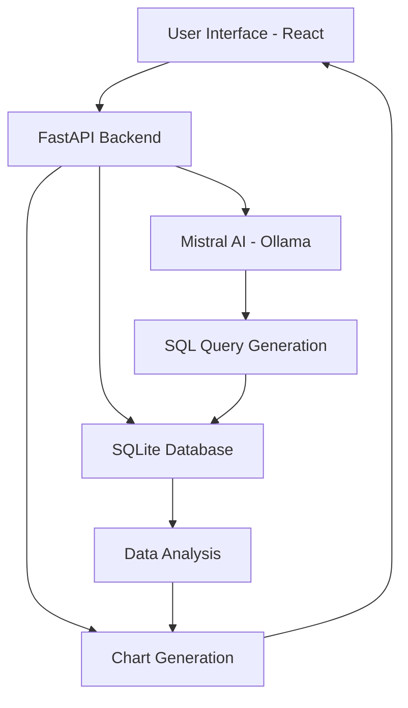

# E-commerce AI Agent 🛒
# Author: ABHISHEK SINGH {21MIS1096}
## VELLORE INSTITUTE OF TECHNOLOGY , CHENNAI
#ASSIGNMENT FOR ANARIX AI
[](https://www.python.org/downloads/)
[](https://reactjs.org/)
[](https://fastapi.tiangolo.com/)
[](https://opensource.org/licenses/MIT)

An intelligent data analysis platform that transforms natural language questions into SQL queries and provides comprehensive e-commerce business insights. Built with FastAPI, React, and Ollama for secure local AI processing.

![E-commerce AI Agent Demo]


## ✨ Features

- 🤖 **Natural Language Querying**: Ask business questions in plain English
- 🧠 **AI-Powered SQL Generation**: Mistral AI converts questions to optimized SQL queries
- 📊 **Interactive 3D Visualizations**: Beautiful charts using React Three Fiber
- 📈 **Real-time Business Metrics**: Comprehensive dashboard with KPIs
- 🔒 **Local AI Processing**: No external API dependencies using Ollama
- 🎨 **Modern UI**: Professional Material-UI design with glassmorphism effects

## 🎯 Demo

**Example Queries:**
- "What is my total sales?"
- "Calculate the Return on Ad Spend (ROAS)"
- "Which product had the highest CPC?"
- "Show me the top 10 products by revenue"

## 🏗️ Architecture



## 🔧 Prerequisites

### System Requirements
- **Python**: 3.8 or higher
- **Node.js**: 16.0 or higher
- **npm**: 8.0 or higher
- **Git**: Latest version
- **OS**: Windows 10/11, macOS, or Linux

### Required Software
- [Ollama](https://ollama.ai) (for local AI processing)
- Python environment (Anaconda recommended)

## 🚀 Quick Start

### 1. Install Ollama

**Windows:**
```bash
# Download from https://ollama.ai/download
ollama --version
```

**macOS:**
```bash
brew install ollama
```

**Linux:**
```bash
curl -fsSL https://ollama.ai/install.sh | sh
```

### 2. Download AI Model
```bash
# Pull the Mistral 7B model (may take several minutes)
ollama pull mistral:7b-instruct
ollama serve
```

### 3. Clone Repository
```bash
git clone https://github.com/yourusername/ecommerce-ai-agent.git
cd ecommerce-ai-agent
```

### 4. Backend Setup
```bash
# Create Python environment
conda create -n anarixsw python=3.9
conda activate anarixsw

# Install dependencies
cd backend
pip install -r requirements.txt
```

### 5. Frontend Setup
```bash
cd ../frontend
npm install
```

### 6. Configuration

**Backend (.env):**
```env
DATABASE_URL=sqlite:///./data/database/ecommerce_data.db
OLLAMA_MODEL=mistral:7b-instruct
OLLAMA_API_URL=http://localhost:11434/api/generate
OLLAMA_TEMPERATURE=0.0
DEBUG=true
ALLOWED_ORIGINS=["http://localhost:3000"]
```

**Frontend (.env):**
```env
REACT_APP_API_URL=http://localhost:8000
REACT_APP_ENVIRONMENT=development
```

### 7. Data Setup
```bash
# Create data directories
mkdir -p backend/data/raw backend/data/database

# Add your Excel files to backend/data/raw/
# - Product-Level Eligibility Table (mapped).xlsx
# - Product-Level Ad Sales and Metrics (mapped).xlsx
# - Product-Level Total Sales and Metrics (mapped).xlsx

# Initialize database
cd backend
python -c "from services.data_processor import DataProcessor; dp = DataProcessor(); dp.load_all_data()"
```

### 8. Run Application
```bash
# Terminal 1 - Ollama
ollama serve

# Terminal 2 - Backend
cd backend && conda activate anarixsw && python main.py

# Terminal 3 - Frontend
cd frontend && npm start
```

**Access the application:**
- Frontend: http://localhost:3000
- Backend API: http://localhost:8000
- API Docs: http://localhost:8000/docs

## 📚 Usage

### Basic Workflow
1. **Dashboard**: View key business metrics and data processing status
2. **Ask AI**: Enter natural language questions about your data
3. **View Results**: See AI-generated responses, SQL queries, and interactive charts

### Example Workflows

**Business Analytics:**
```
👤 User: "What is my total sales?"
🤖 AI: Generates SQL → Executes query → "Your total sales amount to $1,234,567.89"
```

**Performance Analysis:**
```
👤 User: "Calculate the Return on Ad Spend (ROAS)"
🤖 AI: Analyzes ad data → "Your ROAS is 4.67x across 150 products"
```

## 🔌 API Reference

### Query Processing
```http
POST /api/query
Content-Type: application/json

{
  "question": "What is my total sales?",
  "include_chart": true,
  "stream": false
}
```

### Response Format
```json
{
  "response": "Your total sales amount to $1,234,567.89",
  "sql_query": "SELECT SUM(total_sales) as total_sales FROM total_sales_metrics",
  "results": [{"total_sales": 1234567.89}],
  "chart_data": {...},
  "execution_time": 1.23
}
```

### Other Endpoints
- `GET /api/query/examples` - Get example questions
- `GET /health` - Health check
- `GET /api/metrics/summary` - Metrics summary

## 📁 Project Structure

```
ecommerce-ai-agent/
├── 📁 backend/
│   ├── 📁 api/routes/          # API endpoints
│   ├── 📁 core/               # Database & models
│   ├── 📁 services/           # Business logic
│   ├── 📁 data/              # Data storage
│   └── 📄 main.py            # Application entry
├── 📁 frontend/
│   ├── 📁 src/
│   │   ├── 📁 components/     # React components
│   │   ├── 📁 services/       # API services
│   │   └── 📁 hooks/         # Custom hooks
│   └── 📄 package.json
└── 📄 README.md
```

## 🔍 Troubleshooting

<details>
<summary><strong>Ollama Connection Failed</strong></summary>

```bash
# Check if Ollama is running
ollama list

# Restart Ollama service
ollama serve

# Verify model is downloaded
ollama pull mistral:7b-instruct
```
</details>

<details>
<summary><strong>Backend Database Error</strong></summary>

```bash
# Recreate database
cd backend
python -c "from core.database import DatabaseManager; dm = DatabaseManager(); dm.init_database()"
```
</details>

<details>
<summary><strong>Frontend Build Errors</strong></summary>

```bash
# Clear cache and reinstall
cd frontend
rm -rf node_modules package-lock.json
npm install
```
</details>

<details>
<summary><strong>CORS Issues</strong></summary>

- Ensure backend `ALLOWED_ORIGINS` includes `http://localhost:3000`
- Check frontend API URL points to `http://localhost:8000`
</details>

## ⚡ Performance Optimization

### Backend
- Add database indexes for frequently queried columns
- Enable SQLite WAL mode for better concurrency
- Use connection pooling for multiple requests

### Frontend
- Enable React production build: `npm run build`
- Use lazy loading for 3D components
- Implement query result caching

## 🤝 Contributing

We welcome contributions! Please see our [Contributing Guidelines](CONTRIBUTING.md) for details.

1. Fork the repository
2. Create your feature branch: `git checkout -b feature/amazing-feature`
3. Commit your changes: `git commit -m 'Add some amazing feature'`
4. Push to the branch: `git push origin feature/amazing-feature`
5. Open a Pull Request

### Development Guidelines
- Follow PEP 8 for Python code
- Use ESLint/Prettier for JavaScript formatting
- Add tests for new features
- Update documentation for API changes

## 📄 License

This project is licensed under the MIT License - see the [LICENSE](LICENSE) file for details.

## 🆘 Support

- **Issues**: [GitHub Issues](https://github.com/abhishek-7-singh/ecommerce-ai-agent/issues)
- **Discussions**: [GitHub Discussions](https://github.com/abhishek-7-singh/ecommerce-ai-agent/discussions)
- **Email**: abhi11.sbsm@gmail.com

## 🔗 Resources

- [Ollama Documentation](https://ollama.ai/docs)
- [FastAPI Documentation](https://fastapi.tiangolo.com/)
- [React Documentation](https://reactjs.org/docs)
- [Material-UI Documentation](https://mui.com/)

## 🌟 Acknowledgments

- Built with [Mistral AI](https://mistral.ai/) for intelligent query processing
- Powered by [Ollama](https://ollama.ai) for local AI inference
- UI components from [Material-UI](https://mui.com/)
- 3D visualizations with [React Three Fiber](https://docs.pmnd.rs/react-three-fiber)

---

<div align="center">

**Built with ❤️ for e-commerce data analysis**

[⭐ Star this repo](https://github.com/yourusername/ecommerce-ai-agent) | [🐛 Report Bug](https://github.com/yourusername/ecommerce-ai-agent/issues) | [💡 Request Feature](https://github.com/yourusername/ecommerce-ai-agent/issues)

</div>
